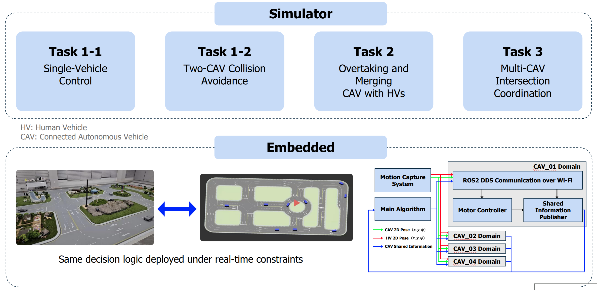
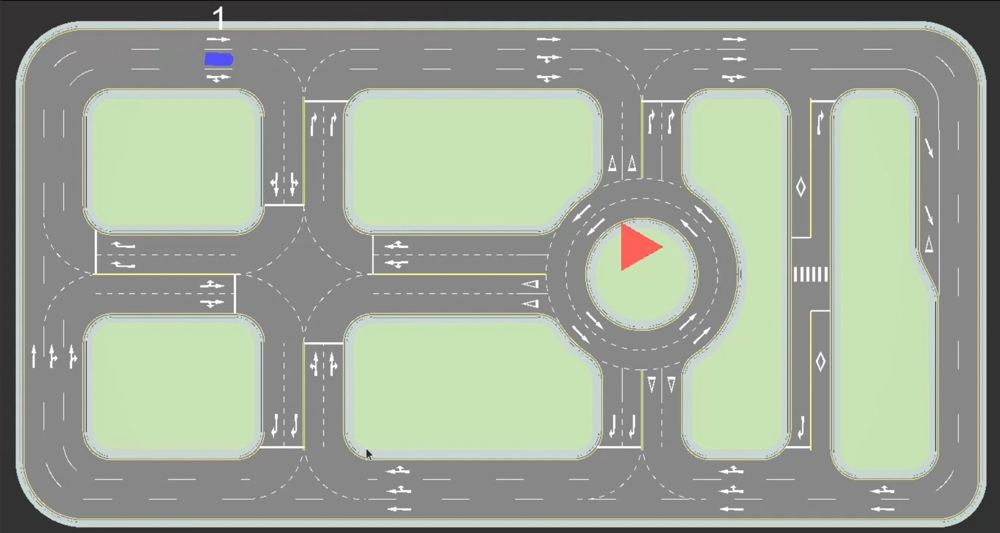
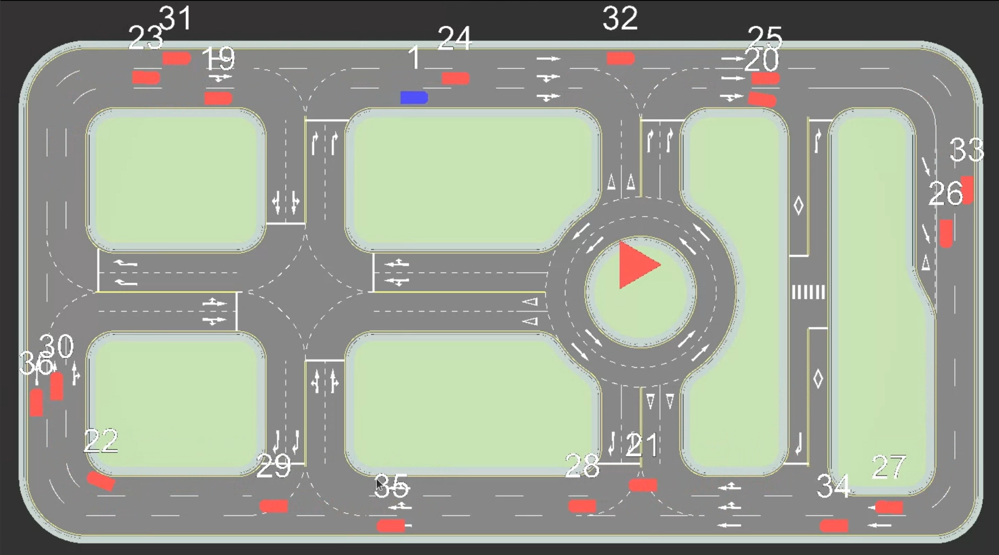
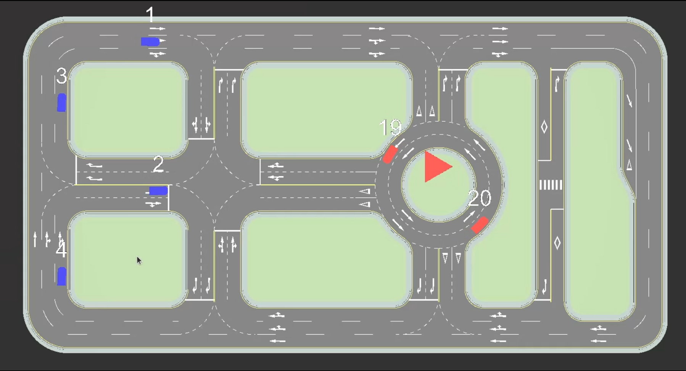

# KAIST Mobility Challenge — CAV Control

This repository contains **Team H6’s implementation** for the **KAIST Mobility Challenge**,
focusing on **connected and autonomous vehicle (CAV) control** in a multi-agent
ROS 2 environment.

<p align="center">
  
</p>

<p align="center">
  <em>
    Overview of competition tasks and system deployment across simulation
    and embedded environments
  </em>
</p>

---

## Overview
- **Event**: KAIST Mobility Challenge  
- **Platform**: ROS 2–based multi-vehicle simulator  
- **Focus**: Multi-CAV non-collision control algorithms for unsignalized intersections and roundabouts  
- **Deployment**: Shared decision and control logic across simulation and embedded systems

---

## 🏆 Real-World Demonstration
We successfully deployed our control algorithm to a physical scale car, verifying the **Sim-to-Real** performance.


> **Figure 1.** Autonomous driving demonstration in a real-world environment.

<br>

<details>
<summary><strong>🔻 Click to view Simulation Verification (Task 1~3)</strong></summary>

Before the real-world test, we verified the logic in the simulator.
> **Click on the images below to watch the full video clips.**

| **Problem 1-1 (Lane Keeping)** | **Problem 1-2 (Obstacle Avoidance)** |
| :---: | :---: |
| [](./assets/task1_1.mp4) | [](./assets/task1_2.mp4) |
| **Problem 2 (Intersection)** | **Problem 3 (Multi-Agent)** |
| [](./assets/task2.mp4) | [](./assets/task3.mp4) |

</details>

---

## Simulator

All competition tasks are implemented and validated using the
**official KAIST Mobility Challenge Simulator**, which is included in this repository
as a pinned submodule.

<p align="center">
  <a href="https://github.com/cislab-kaist/Mobility_Challenge_Simulator">
    
    
  </a>
</p>

### Implemented Tasks (Simulation)
- **Task 1-1**: Single-vehicle control  
- **Task 1-2**: Two-CAV collision avoidance  
- **Task 2**: Overtaking and merging with human-driven vehicles (HVs)  
- **Task 3**: Multi-CAV coordination at unsignalized intersections  

Each task is implemented in a dedicated ROS 2 package:
`pkg_task_1_1/`, `pkg_task_1_2/`, `pkg_task_2/`, and `pkg_task_3/`.

---


## How to Run
### 0. Prerequisites
- Docker installed
- Linux (Ubuntu 20.04 recommended)
- X11 available (for simulator GUI)

**Clone**
```bash
git clone https://github.com/kmin2426/KAIST-Mobility-Challenge-H6.git
```

**Build Docker Image**
```bash
cd ~/KAIST-Mobility-Challenge-H6
docker build -t h6 .
```

<br><br>

### 1. Run Simulator (GUI)
- **task1-1**: L+1
- **task1-2**: L+2
- **task2**: L+3
- **task3**: L+4

```bash
xhost +local:docker

docker run --rm -it \
  --net=host \
  --ipc=host \
  -e RUN_MODE=sim \
  -e ROS_DOMAIN_ID=100 \
  -e ROS_LOCALHOST_ONLY=0 \
  -e RMW_IMPLEMENTATION=rmw_fastrtps_cpp \
  -e DISPLAY=$DISPLAY \
  -v /tmp/.X11-unix:/tmp/.X11-unix:rw \
  --device /dev/dri \
  h6
```

<br><br>

### 2. Run Algorithms (in a Separate Terminal)
**Problem 1-1**
```bash
docker run --rm -it \
  --net=host \
  --ipc=host \
  -e RUN_MODE=algorithm \
  -e PROBLEM_ID=1 \
  -e ROS_DOMAIN_ID=100 \
  -e ROS_LOCALHOST_ONLY=0 \
  -e RMW_IMPLEMENTATION=rmw_fastrtps_cpp \
  h6
```

**Problem 1-2**
```bash
docker run --rm -it \
  --net=host \
  --ipc=host \
  -e RUN_MODE=algorithm \
  -e PROBLEM_ID=2 \
  -e ROS_DOMAIN_ID=100 \
  -e ROS_LOCALHOST_ONLY=0 \
  -e RMW_IMPLEMENTATION=rmw_fastrtps_cpp \
  h6
```

**Problem 2**
```bash
docker run --rm -it \
  --net=host \
  --ipc=host \
  -e RUN_MODE=algorithm \
  -e PROBLEM_ID=3 \
  -e ROS_DOMAIN_ID=100 \
  -e ROS_LOCALHOST_ONLY=0 \
  -e RMW_IMPLEMENTATION=rmw_fastrtps_cpp \
  h6
```

**Problem 3**
```bash
docker run --rm -it \
  --net=host \
  --ipc=host \
  -e RUN_MODE=algorithm \
  -e PROBLEM_ID=4 \
  -e ROS_DOMAIN_ID=100 \
  -e ROS_LOCALHOST_ONLY=0 \
  -e RMW_IMPLEMENTATION=rmw_fastrtps_cpp \
  h6
```

**Topic List**
```bash
source /opt/ros/foxy/setup.bash
export ROS_DOMAIN_ID=100
export ROS_LOCALHOST_ONLY=0
export RMW_IMPLEMENTATION=rmw_cyclonedds_cpp
ros2 daemon stop
rm -rf ~/.ros/ros2cli ~/.ros/log
ros2 daemon start
ros2 topic list | grep CAV
```
---

## Notes
- Structured Git workflow (feature → dev → main)
- Build artifacts and logs excluded via `.gitignore`
- Designed and finalized for official KAIST Mobility Challenge submission
