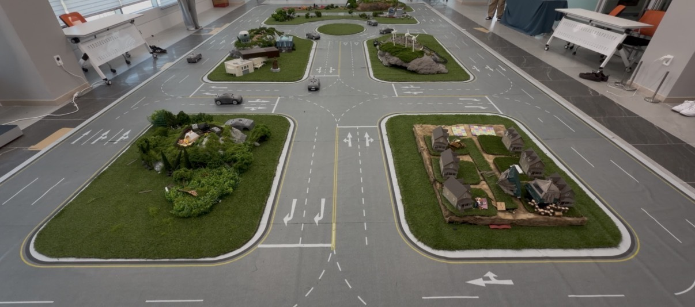

## Embedded Demonstration

<p align="center">
  
</p>

<p align="center">
  <em>Embedded testbed run (Task 3)</em>
</p>

## 0. Architecture

```
[Control Laptop]
(Task 3 Python Node) → publishes /cmd_vel (Wi-Fi, ROS 2 DDS)
↓
[Jetson Orin (On Vehicle)]
subscribes to /cmd_vel
SDK / ROS 2 C++ node: drv.setCommand(linear, omega)
→ UART transmission (0xA5) via /dev/ttyKMC
↓
[Raspberry Pi (Inside Vehicle)]
UART reception → motor and steering actuation
```

 `/cmd_vel`

- CAV01 Jetson: `ROS_DOMAIN_ID=100`
- CAV02 Jetson: `ROS_DOMAIN_ID=100`
- CAV03 Jetson: `ROS_DOMAIN_ID=100`
- CAV04 Jetson: `ROS_DOMAIN_ID=100`

---

## 1. Initial Vehicle Setup

- password: 1234

Domain ID

```
# Check Domain_ID
env | grep ROS_DOMAIN_ID

# Set Domain_ID
export ROS_DOMAIN_ID=100
```

Git clone

```
git clone https://github.com/Seo12044/KAIST_Mobility_Challenge_SDK.git
```

Install ROS2 Foxy:

```bash
sudo apt update
sudo apt install -y software-properties-common
sudo add-apt-repository universe

sudo apt update
sudo apt install -y curl ca-certificates gnupg lsb-release

sudo curl -sSL https://raw.githubusercontent.com/ros/rosdistro/master/ros.key \
  -o /usr/share/keyrings/ros-archive-keyring.gpg

echo "deb [arch=$(dpkg --print-architecture) signed-by=/usr/share/keyrings/ros-archive-keyring.gpg] \
http://packages.ros.org/ros2/ubuntu $(. /etc/os-release && echo $UBUNTU_CODENAME) main" \
| sudo tee /etc/apt/sources.list.d/ros2.list > /dev/null

sudo apt update
sudo apt install -y ros-foxy-ros-base python3-colcon-common-extensions python3-rosdep python3-argcomplete

sudo rosdep init || true
rosdep update

echo "source /opt/ros/foxy/setup.bash" >> ~/.bashrc
source /opt/ros/foxy/setup.bash

sudo apt update
sudo apt install -y ros-foxy-ros-base

```

SDK Setup:

```bash
cd ~/KAIST_Mobility_Challenge_SDK
mkdir -p src
```

Link Driver Package: 

```bash
rm -rf src/kmc_hardware_driver_node
ln -s ../examples/Driver_ROS2 src/kmc_hardware_driver_node
```

Build and Verify

```bash
source /opt/ros/foxy/setup.bash
cd ~/KAIST_Mobility_Challenge_SDK
rm -rf build installlog

colcon list --base-paths src
colcon build --symlink-install --base-paths src --packages-select kmc_hardware_driver_node

source install/setup.bash
ros2 pkg executables kmc_hardware_driver_node
```

Fix ROS Domain

```bash
export ROS_DOMAIN_ID=100
source /opt/ros/foxy/setup.bash
source ~/KAIST_Mobility_Challenge_SDK/install/setup.bash
```

Serial Port Check

```bash
ls -l /dev/ttyKMC /dev/ttyUSB* /dev/ttyACM* 2>/dev/null
```
- ttySUB0 또는 ttyUSB1

**RUn Driver Node**

```bash
ros2 run kmc_hardware_driver_node kmc_hardware_driver_read_allstate_node \
  --ros-args -p port:=/dev/ttyKMC -r cmd_vel:=/CAV_09/cmd_vel
```

- if `/dev/ttyKMC` is not available:

```bash
ros2 run kmc_hardware_driver_node kmc_hardware_driver_read_allstate_node \
  --ros-args -p port:=/dev/ttyUSB0 -r cmd_vel:=/CAV_28/cmd_vel
```

---

## 2. Vehicle Control

### 2-1. Emergency Stop (via SSH)
- Specify CAV ID
- Example: CAV_28
```bash
export ROS_DOMAIN_ID=100
source /opt/ros/foxy/setup.bash
ros2 topic pub --once /CAV_28/cmd_vel geometry_msgs/msg/Twist \
"{linear: {x: 0.0}, angular: {z: 0.0}}"
```


### 2-2. High-Rate Control (Single Execution)
- Specify CAV ID
- Set port based on detected device
```bash
ros2 run kmc_hardware_driver_node kmc_hardware_high_rate_control_node \
  --ros-args \
  -p port:=/dev/ttyUSB0 \
  -p baud:=1000000 \
  -p control_rate_hz:=1000.0 \
  -p vehicle_speed_rate_hz:=100.0 \
  -p command_refresh_hz:=50.0 \
  -r cmd_vel:=/CAV_28/cmd_vel
```

### 2-4. Run [task3.py](http://task3.py) (Local)

```bash
export ROS_DOMAIN_ID=100 
source /opt/ros/foxy/setup.bash 
python3 task3.py
```
---
## 3. Simulator Execution

### 3-1 Launch Simulator

```bash
cd ~/Desktop/Mobility_Challenge_Simulator
source /opt/ros/foxy/setup.bash
source install/setup.bash
export ROS_DOMAIN_ID=100
ros2 launch simulator_launch simulator_launch.py
```

### 3-2 Apply Control Code (Simulation)
- Simulator control script: simul.py
  
```bash
source /opt/ros/foxy/setup.bash
source ~/Mobility_Challenge_Simulator/install/setup.bash
export ROS_DOMAIN_ID=100

cd ~/Desktop/Mobility_Challenge_Simulator/src/central_control/task3
python3 task3.py
```
